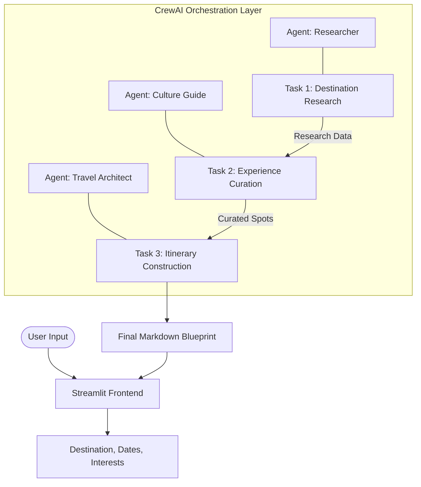

# System Architecture

The Travel Planner AI is a multi-agent orchestration system built on the CrewAI framework. It operates on a principle of delegated intelligence, where complex planning is broken down into a series of dependent tasks executed by specialized agents.

## Technical Stack

| Component | Technology | Role |
| :--- | :--- | :--- |
| **Orchestration** | CrewAI | Manages agent lifecycles, task delegation, and context passing. |
| **Inference Engine** | Groq (Llama 3.3 70B) | Provides high-speed, high-reasoning LLM capabilities. |
| **Frontend** | Streamlit | Handles user input and displays the agentic workflow in real-time. |
| **Data Retrieval** | Serper Dev API | Facilitates real-time web search to ground agent responses in factual data. |
| **Language** | Python 3.11 | Core development and runtime language. |

## The Orchestration Flow

The system utilizes a `SequentialProcess` where the output of one task serves as the immutable context for the next. This ensures that the final itinerary is strictly grounded in the research gathered in previous steps.

## Agent Communications and Context

The system uses a stateful context-passing mechanism to maintain coherence across the 3-agent pipeline.

1.  **Context Injection**: The `location_expert` gathers raw data (weather, logistics, costs).
2.  **Synthesis**: This data is passed to the `guide_expert`, who filters the raw data through a "cultural lens" to find high-value locations.
3.  **Final Blueprint**: The `planner_expert` receives the curated list and the logistical constraints to build the final time-slotted itinerary.

## Operational Logics

### 1. Spatiotemporal Optimization
The `planner_expert` agent is instructed to group locations geographically. This minimizes travel time during the day (e.g., grouping all morning activities in one neighborhood).

### 2. Multi-Tier Budgeting Logic
Rather than a single estimate, the system generates a comparative matrix for financial planning:

| Tier | Basis |
| :--- | :--- |
| **Budget** | Focuses on hostels, public transport, and street food. |
| **Mid-Range** | Includes standard hotels, private transit, and seated dining. |
| **Comfort** | Prioritizes premium hotels, private tours, and fine dining. |

### 3. Geospatial deep-linking
To make the itinerary actionable, every venue name is passed through a regex-driven prompt directive that generates a direct Google Maps URL:
`https://www.google.com/maps/search/?api=1&query={location_name}+{city}`

## Stability and Rate Limiting
To ensure reliability on free-tier inference APIs, the system enforces a `max_rpm=3` constraint. This prevents the orchestration layer from overwhelming the LLM provider while maintaining a steady data infusion rate for the agents.
